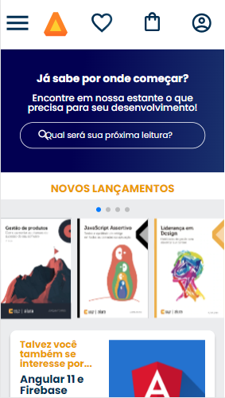
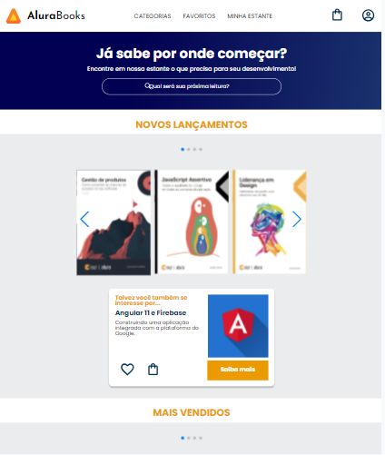
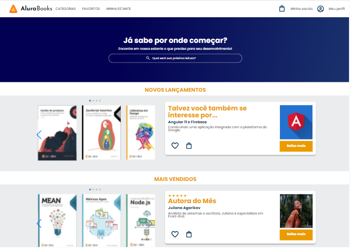

# Alura Book

Projeto frontend de um Alura Books, desenvolvido no curso de Responsividade [Alura](https://www.alura.com.br).

## Preview
> Através desse [link](https://gessycaborges.github.io/projeto-alura-books/) você consegue ver uma prévia do site e abaixo as imagens em diferentes tamanhos de tela.

### Em tela de Celular

### Em tela de no mínimo 1024px

### Em tela de no mínimo 1728px

